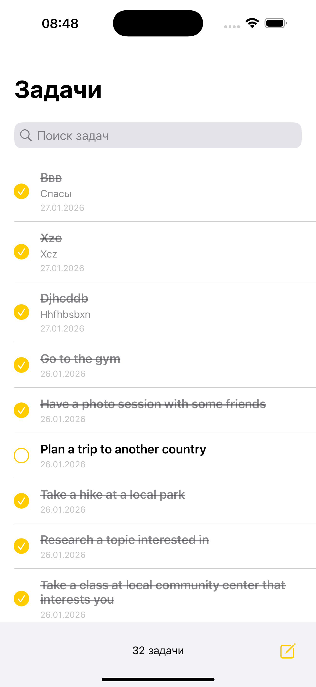

# ToDo List — iOS Test Assignment

iOS приложение для управления задачами с VIPER архитектурой, CoreData и интеграцией с API.

## 📸 Screenshots

| Task List (Dark) | Task List (Light) |
|------------------|-------------------|
|  |  |

| View Mode | Edit Mode |
|----------|-----------|
|  |  |

| Create Task | Empty State |
|------------|------------|
|  |  |

## 🎯 Выполненные требования

✅ Список задач (создание, редактирование, удаление, поиск)
✅ Режимы экрана задачи: просмотр / редактирование / создание
✅ Загрузка из API при первом запуске (https://dummyjson.com/todos)
✅ Многопоточность (GCD, UI на main thread)
✅ CoreData персистентность
✅ Git с чистой историей коммитов
✅ Unit-тесты (48+ тестов)
✅ **VIPER архитектура**

## 🏗 Архитектура

**VIPER** — чёткое разделение на View, Interactor, Presenter, Entity, Router:
- **TaskList** — модуль списка задач
- **TaskEdit** — модуль создания, просмотра и редактирования

**Слои:**
- Domain — TaskEntity (чистая Swift struct)
- Data — Repository, CoreData, Network (DTO/Mapper)
- Presentation — VIPER модули

**Ключевые паттерны:**
- Repository Pattern (абстракция хранилища)
- DTO Pattern (изоляция от API)
- Protocol-Oriented Design
- Dependency Injection

## 🔧 Технологии

- Swift 5.9+, UIKit (programmatic UI)
- CoreData (background contexts)
- URLSession, GCD
- UITableViewDiffableDataSource
- XCTest (48+ unit-тестов)

## 🚀 Запуск
```bash
open TodoApp.xcodeproj
# Cmd+R для запуска
# Cmd+U для тестов
```

**Первый запуск:** автоматически загрузит ~30 задач с API и сохранит локально.

## 📁 Структура
```
TodoApp/
├── App/                    # AppDelegate, SceneDelegate, Helpers
├── Modules/
│   ├── TaskList/          # VIPER: View, Presenter, Interactor, Router, Assembly
│   └── TaskEdit/          # VIPER: View, Presenter, Interactor, Router, Assembly
├── Domain/
│   └── Entities/          # TaskEntity
├── Data/
│   ├── CoreData/          # Stack, Models
│   ├── Repository/        # TaskRepository
│   └── Network/           # NetworkService, DTO, Mapper
└── Tests/                 # Unit-тесты (48+)
```

## 🧪 Тестирование

- TaskListInteractor (10 тестов)
- TaskListPresenter (15 тестов)
- TaskEditInteractor (8 тестов)
- TaskEditPresenter (15 тестов)

Что тестируется: CRUD операции, поиск, валидация, обработка ошибок, преобразование данных.

## ⚡️ Особенности реализации

**Потокобезопасность:**
- CoreData: viewContext (main), background contexts (запись)
- ThreadSafetyHelpers + assertions для проверки
- Все UI обновления гарантированно на main thread

**Управление состоянием:**
- NotificationCenter для межмодульной коммуникации
- Diffable Data Source с автоматическими анимациями
- Оптимистичное обновление UI

**UX:**
- Pull-to-refresh
- Context menu (долгий тап)
- Empty states с понятными сообщениями
- Индикаторы загрузки
- Автоматический фокус на поля ввода
                                      
**Режимы экрана TaskEdit:**
- `.view` — только просмотр, без возможности редактирования
- `.edit` — редактирование существующей задачи
- `.create` — создание новой задачи
                                      
Позволяет переиспользовать один экран для разных сценариев и уменьшить дублирование UI-кода.

## 🎨 Дизайн

Следует Figma макету: тёмная тема, жёлтые акценты, минималистичный интерфейс, автоподдержка светлой/тёмной темы.

---

**Проект демонстрирует:**
- уверенное владение UIKit
- понимание архитектурных принципов iOS
- умение проектировать масштабируемые модули
- написание тестируемого, поддерживаемого кода
