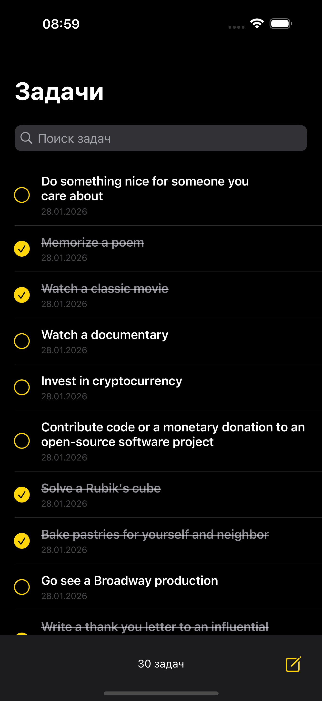
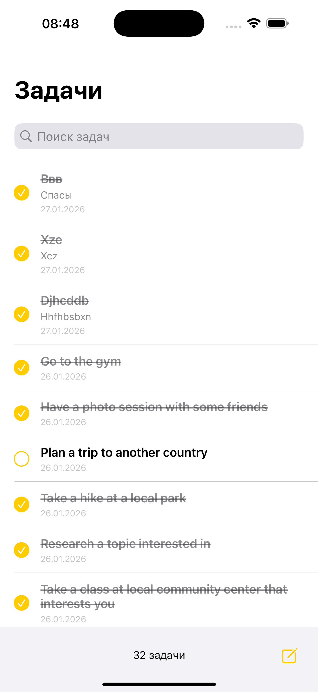

# ✅ TodoApp

> iOS приложение для управления задачами.  
> Проект существует в двух ветках — намеренно, чтобы показать эволюцию архитектуры.

---

## 🌿 Ветки проекта

| Ветка | Стек | Архитектура |
|-------|------|-------------|
| `main` | UIKit · CoreData · GCD · XCTest | VIPER |
| `feature/swiftui-migration` | SwiftUI · SwiftData · async/await · Swift Testing | MVVM |

> Смотри [Pull Request](../../pulls) чтобы увидеть полный diff миграции

---

## 📸 Screenshots

### SwiftUI версия (`feature/swiftui-migration`)

| Task List | Empty State | Detail |
|-----------|-------------|--------|
|  |  |  |

### UIKit версия (`main`)

| Task List (Dark) | Task List (Light) | Edit Mode |
|-----------------|-------------------|-----------|
|  |  |  |

---

## 🏗 Архитектура — SwiftUI ветка

```
Presentation ──► Domain ◄── Data ◄── Core
```

```
TodoApp/
├── App/
│   └── BookNookApp.swift          # @main, ModelContainer, DI setup
├── Core/
│   ├── DI/
│   │   └── AppDependencies.swift  # @Observable DI контейнер
│   └── Extensions/
│       └── Int+Tasks.swift        # Русская плюрализация
├── Domain/
│   └── Models/
│       └── TaskItem.swift         # @Model (SwiftData)
├── Data/
│   ├── Repository/
│   │   ├── TaskRepositoryProtocol.swift
│   │   └── TaskRepository.swift   # SwiftData + FetchDescriptor
│   └── Network/
│       ├── NetworkService.swift   # async/await URLSession
│       ├── TodoDTO.swift
│       └── TodoMapper.swift
└── Presentation/
    ├── ContentView.swift           # DI wiring
    ├── TaskList/
    │   ├── TaskListView.swift      # List + searchable + swipeActions
    │   ├── TaskListViewModel.swift # @Observable @MainActor
    │   └── TaskRowView.swift
    ├── TaskDetail/
    │   └── TaskDetailView.swift    # @Bindable, view/edit modes
    └── CreateTask/
        └── CreateTaskView.swift
```

---

## 🔧 Технологии — SwiftUI ветка

| Категория | Технология | Зачем |
|-----------|-----------|-------|
| UI | SwiftUI 5 | Декларативный UI |
| Персистентность | SwiftData + `@Model` | Замена CoreData |
| Реактивность | `@Observable` | Замена ObservableObject |
| Сеть | async/await URLSession | Замена GCD + callbacks |
| Навигация | NavigationStack + `.navigationDestination` | Type-safe роутинг |
| DI | `@Environment` + `AppDependencies` | Без синглтонов |
| Тесты | Swift Testing (`@Test`, `#expect`) | Замена XCTest |

---

## 🧪 Тестирование

```bash
Cmd+U   # запуск всех тестов
```

**Покрытие:** ViewModel логика — 8 тестов

| Тест | Что проверяет |
|------|--------------|
| `loadTasks_success` | tasks заполняются, isLoading сбрасывается |
| `loadTasks_failure` | errorMessage устанавливается при ошибке |
| `toggleCompletion` | isCompleted меняется, update вызывается |
| `toggleCompletion_rollback` | откат при ошибке сохранения |
| `delete` | задача удаляется из массива |
| `createTask` | добавляется в начало списка |
| `createTask_emptyTitle` | валидация, repository не вызывается |
| `loadTasks_withQuery` | search вызывается вместо fetchAll |

---

## 🚀 Запуск

```bash
# 1. Клонируй репозиторий
git clone https://github.com/username/TodoApp.git
cd TodoApp

# 2. SwiftUI ветка
git checkout feature/swiftui-migration

# 3. Открой в Xcode
open TodoApp.xcodeproj

# 4. Cmd+R — первый запуск загрузит ~30 задач с dummyjson.com
# 5. Cmd+U — запуск тестов
```

**Требования:** Xcode 15+, iOS 17+, интернет при первом запуске

---

## ⚡️ Ключевые решения

**`@Observable` вместо `ObservableObject`**  
Гранулярные обновления UI — SwiftUI перерисовывает только те части View, которые читают изменившееся свойство. Убраны все `@Published`.

**`@MainActor` на Repository и ViewModel**  
`ModelContext` не thread-safe. Явная аннотация `@MainActor` вместо ручных `DispatchQueue.main.async` — компилятор гарантирует корректность.

**Оптимистичное обновление с rollback**  
`toggleCompletion` сначала меняет UI, потом сохраняет. При ошибке — откатывает. UX не страдает от задержек IO.

**`ContentUnavailableView`**  
Нативный iOS 17 компонент для empty/error состояний. Автоматически адаптируется под Dark Mode и Dynamic Type.

**`@discardableResult` на `update(task:)`**  
Метод возвращает `TaskItem` для удобства chaining, но вызывающий код не обязан использовать результат.

---

## 🌿 Git история

Миграция разбита на атомарные коммиты — каждый коммит компилируется:

```
feat(ui): implement SwiftUI screens replacing UIKit ViewControllers
feat(di): add AppDependencies container replacing manual wiring
test: add TaskListViewModel unit tests with Swift Testing
refactor(repository): migrate TaskRepository to SwiftData + async/await
refactor(network): migrate NetworkService to async/await
feat(domain): replace TaskEntity struct + CoreData with SwiftData @Model
chore(setup): migrate project entry point to SwiftUI App lifecycle
```

---

## 📊 Сравнение веток

| | UIKit (`main`) | SwiftUI (`feature`) |
|--|----------------|---------------------|
| Строк кода | ~1800 | ~900 |
| Файлов | 28 | 16 |
| Тестов | 48 | 8 (ViewModel only) |
| Архитектура | VIPER (5 слоёв) | MVVM (3 слоя) |
| Потоки | GCD вручную | `@MainActor` |
| Персистентность | CoreData + NSFetchRequest | SwiftData + `#Predicate` |
| Навигация | Router + UINavigationController | NavigationStack + `.navigationDestination` |

---

## 👤 Автор

**Тадевос Курдоглян**  
[GitHub](https://github.com/username) · [LinkedIn](https://linkedin.com/in/username)
